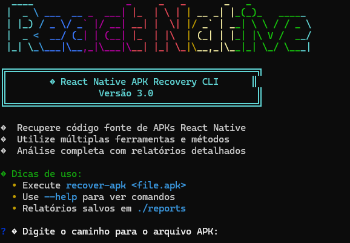

# RN APK Recovery CLI



<p align="center">
    <a href="https://www.npmjs.com/package/recover-rn"></a>
    <a href="#"></a>
    <a href="./LICENSE"></a>
</p>

---

**Sumário**

- [Features](#features)
- [Installation](#installation)
- [Getting Started](#getting-started)
- [Usage](#usage)
- [Roadmap (Next Steps)](#roadmap-next-steps)
- [How to Contribute](#how-to-contribute)
- [License](#license)

---

## Features

- **Interactive Interface:** A user-friendly menu guides you through all recovery options.
- **Modular Tools:** Choose from a variety of recovery modules:
  - **Basic Extraction (Unzip):** Quickly extracts files from the APK.
  - **Advanced Decompilation (APKTool):** Disassembles the APK into a readable file structure.
  - **JavaScript Beautifier:** Formats the JavaScript bundle to improve readability.
  - **Bundle Analysis:** Detects libraries and provides statistics about the JS bundle.
  - **Asset Extraction:** Copies all application assets (images, fonts, icons).
  - **Bundle Visualizer:** Runs `react-native-bundle-visualizer` for a graphical analysis.
- **Customizable Process:** Run a full analysis with a single command or select only the tools you need.
- **Detailed Reports:** Generates a final Markdown report summarizing the process, created directories, and recommendations.
- **Dependency Check:** Automatically verifies if required tools (like `unzip` and `apktool`) are installed.
---
## Installation

To use this tool, you will need Node.js (version 16 or higher) and `unzip` installed on your system.

The recommended method is to use `npx`, which runs the package without needing a global installation.

```bash
# Run without installing
npx recover-rn
```

Alternatively, you can install it globally using `npm`:

```bash
# Install globally via NPM
npm install -g recover-rn
```
---
## Getting Started

To get started, simply run the command in your terminal. The tool will launch and prompt you for the path to the `.apk` file you want to analyze.

```bash
recover-rn
```

> The script will then guide you through an interactive menu where you can select the desired recovery options.
---
## Usage

After providing the path to your APK, you will be presented with a menu of recovery options. You can choose to run a full analysis, which is the recommended option for a comprehensive overview, or select specific tasks like extracting assets or beautifying the JavaScript bundle.

The tool will create a set of directories prefixed with the name of your APK, each containing the output of the selected recovery modules.
---
## Roadmap (Next Steps)

This tool is actively being developed. Here are some of the features planned for future releases:

- **IPA File Support:** Add support for recovering source code from iOS application archives.
- **Automatic Project Scaffolding:** Create a new React Native project structure based on the recovered bundle and dependencies.
- **Source Map Integration:** If a source map is found, use it to reconstruct a more accurate and readable version of the original source code.
- **Graphical User Interface (GUI):** Develop a desktop application to make the recovery process even more accessible.
---
## How to Contribute

Contributions are highly welcome! If you have ideas for new features, improvements, or bug fixes, please feel free to open an issue or submit a pull request.

1.  Fork the repository.
2.  Create a new branch (`git checkout -b feature/your-feature`).
3.  Make your changes.
4.  Commit your changes (`git commit -m 'Add some feature'`).
5.  Push to the branch (`git push origin feature/your-feature`).
6.  Open a Pull Request.
---
## License

This project is distributed under the MIT License.
